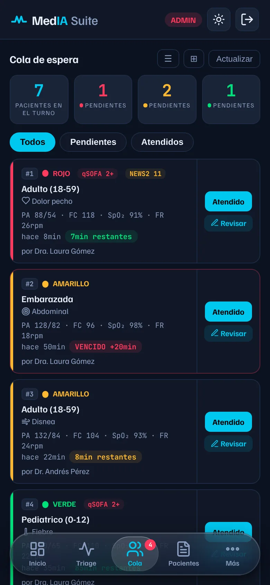
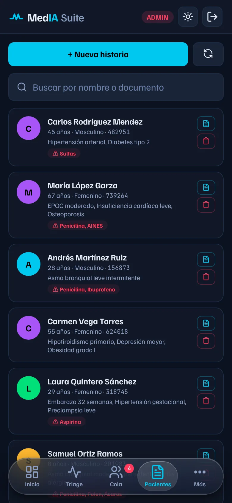
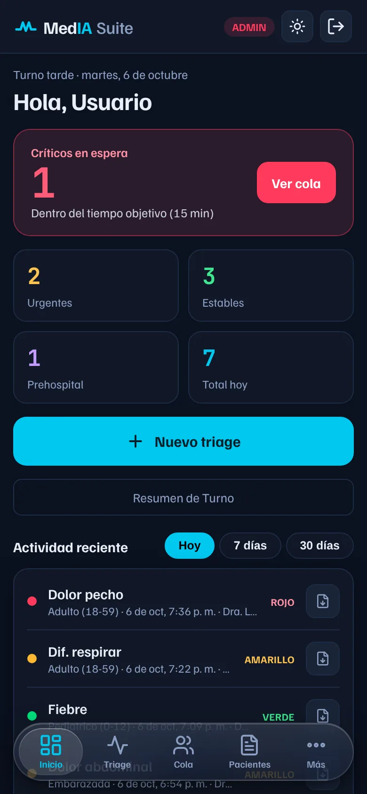
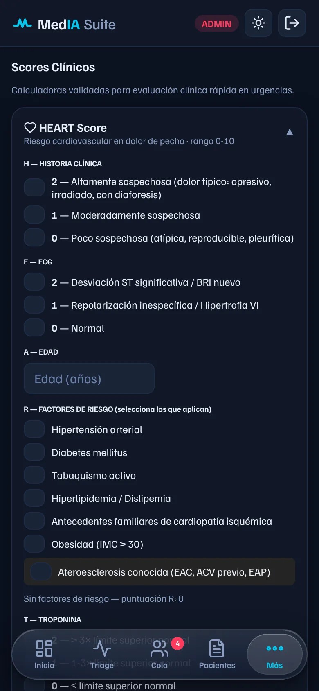
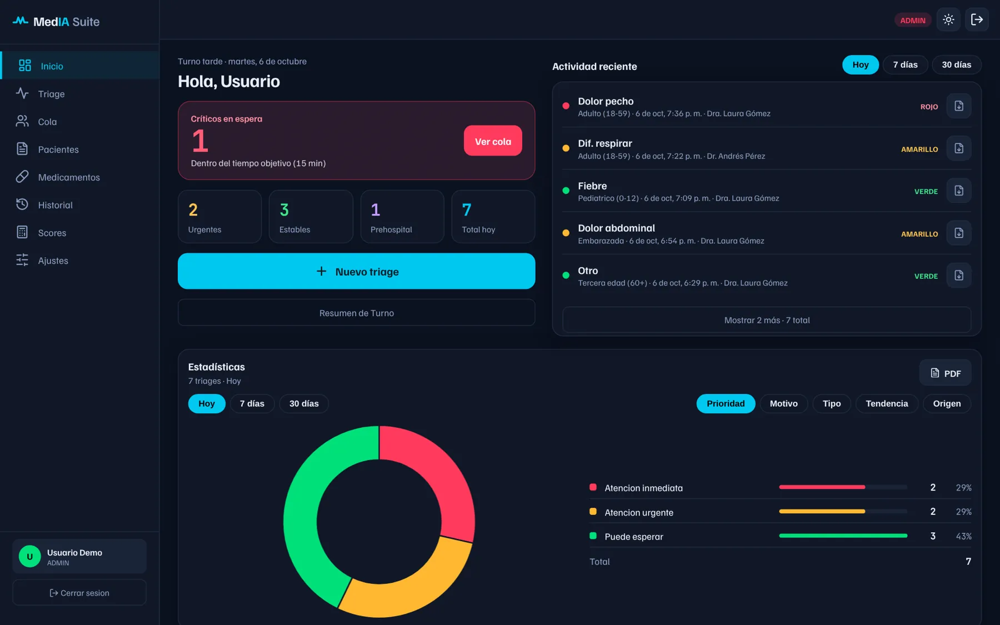

<div align="center">

# MedIA Suite

**Triage de urgencias con apoyo de IA, en una app web instalable**

[](https://github.com/modarox28/triage-ia/actions/workflows/tests.yml)


[**Probar la demo**](https://media-suite-6f432.web.app/?demo=1) · [Página del proyecto](https://modarox28.github.io/medai-lander/) · [App](https://media-suite-6f432.web.app)


&nbsp;

&nbsp;


</div>

## El problema

En una sala de urgencias, el orden de atención depende de clasificar bien a cada paciente y de no perder de vista cuánto lleva esperando. Muchas veces se hace en papel o de memoria. MedIA Suite lo digitaliza:

- **Clasifica** a cada paciente en rojo, amarillo o verde según sus signos vitales y síntomas, con un tiempo máximo de espera.
- **Ordena la cola** en tiempo real para todo el equipo y **avisa** cuando un paciente rojo supera su tiempo.
- **Sugiere** con IA la prioridad y las primeras acciones, explicando por qué. La decisión siempre es del médico.
- **Guarda** la historia clínica, con búsqueda por nombre o documento y exportación a PDF.

La demo no pide registro: entra como administrador con pacientes ficticios, en una base de datos en memoria que se reinicia al salir.

## Lo más interesante técnicamente

| Reto | Cómo lo resolví |
|------|-----------------|
| Usar IA sin exponer la API key ni pagar servidores | Un **Cloudflare Worker** gratuito hace de proxy: verifica la firma del token de Firebase, lee el rol del usuario y aplica un cupo diario en KV. La clave nunca llega al navegador. |
| Datos clínicos protegidos sin backend propio | **Reglas de Firestore por rol** (paciente, médico, admin de hospital, admin). Nadie puede asignarse un rol, ni siquiera manipulando el navegador. |
| Restablecer el PIN de un paciente sin Cloud Functions (plan gratis) | El Worker firma un JWT con una cuenta de servicio y llama a la API de administración de Firebase Auth. |
| Buscar "rodri" y encontrar "Rodríguez" en una base que no busca texto parcial | Cada historia guarda **claves de búsqueda** normalizadas (sin tildes, prefijos de nombre y documento). |
| Que cualquiera pueda probarla sin cuentas ni gastar cuota | **Modo demo** con un Firebase simulado en memoria y la misma interfaz real. |
| Confiar en los cálculos clínicos | **69 pruebas unitarias** (scores como qSOFA, NEWS2 y HEART contra sus criterios publicados, seguridad del Worker, PDF, búsqueda) y **11 pruebas de extremo a extremo** con Playwright en GitHub Actions. |
| Que no se pierda un triage si se cae internet | Sin conexión (o si la IA no responde) se calcula una **clasificación provisional** con reglas de signos vitales, NEWS2 y qSOFA; el triage se guarda en el dispositivo con un id propio y se envía solo al volver la conexión, sin duplicados. |
| Saber quién cambió qué en un triage | Cada triage lleva un **registro de cambios** (creación, atendido, reclasificación con razón). Las reglas de Firestore solo dejan agregar entradas, nunca borrarlas. |
| Que sea usable por todos | **axe-core** sin fallas WCAG 2 AA en todas las pantallas y **Lighthouse** en cada cambio (accesibilidad 100 en el modo demo). |
| Funcionar bien en celular | PWA instalable, barra inferior que respeta la barra de gestos de iOS y Android, tema claro/oscuro y 6 idiomas. |

## Capturas

| Inicio (celular) | Scores clínicos | Escritorio |
|:-:|:-:|:-:|
|  |  |  |

## Autor

**Moisés** ([@modarox28](https://github.com/modarox28)), estudiante de Ingeniería de Sistemas en la Universidad Autónoma del Caribe, Colombia. Diseñé y desarrollé el proyecto completo: interfaz, lógica clínica, seguridad del servidor y pruebas.

> Proyecto académico. Es una herramienta de apoyo a la decisión clínica, no un dispositivo médico certificado.

---

# Documentación técnica

## Módulos

| Módulo | Descripción |
|--------|-------------|
| **TriageIA** | Clasificación de urgencias ESI/Manchester con asistente clínico IA |
| **MediApp** | Gestión de medicamentos: dosis, alarmas, interacciones |
| **MCI** | Incidentes con múltiples víctimas: asistente START + PDF |
| **Scores clínicos** | HEART, qSOFA, NEWS2, CURB-65, Wells, Glasgow, ROSIER |
| **Cola de pacientes** | Cola en tiempo real, tablero kanban, override médico |
| **Historia clínica** | Antecedentes, alergias, medicación e historial de triages del paciente; exportación a PDF |

## Stack

- **HTML, CSS y JavaScript** sin frameworks ni paso de compilación
- **Firebase Auth**: Google, correo/contraseña y acceso de pacientes con ID + PIN
- **Cloud Firestore**: base de datos en tiempo real, protegida con reglas por rol
- **Firebase Hosting**: plan gratuito (Spark)
- **Cloudflare Worker + KV**: proxy hacia la API de DeepSeek que verifica la sesión y aplica límites diarios; la clave nunca llega al navegador
- **Pruebas**: `node:test` y GitHub Actions en cada push
- **PWA**: instalable en Android, iOS y escritorio (manifest + service worker)

## Arquitectura

```
Navegador (PWA) ──► Firebase Auth / Firestore      (datos y sesiones)
       │
       └──────────► Cloudflare Worker ──► DeepSeek  (IA; la API key vive en Cloudflare)
                     │  1. verifica el token de Firebase (firma de Google)
                     │  2. lee el rol en Firestore con ese token
                     └─ 3. cupo diario por usuario en Workers KV
```

## Estructura del proyecto

```
├── index.html                 # Solo el HTML de las pantallas; carga los CSS y JS de src/
├── src/
│   ├── app/                   # Lógica de la interfaz (scripts clásicos, se cargan en orden)
│   │   ├── firebase-init.js   #   Inicializa Firebase y expone helpers (módulo ES)
│   │   ├── 00-iconos.js       #   Íconos SVG de la app y reemplazo automático de emojis por íconos
│   │   ├── 00-estado.js       #   Estado global, auditoría, tema, toast
│   │   ├── 01-auth.js         #   Login de personal, roles, inactividad
│   │   ├── 02-voz-notas.js    #   Modo voz y validación de notas clínicas
│   │   ├── 03-navegacion.js   #   Navegación, gráfica, centros cercanos
│   │   ├── 04-dashboard-historial.js
│   │   ├── 05-perfil-qr.js
│   │   ├── 06-pacientes.js    #   Acceso de pacientes (ID + PIN) e historia en el triage
│   │   ├── 07-pwa.js
│   │   ├── 08-triage.js       #   Pasos del triage y resultado con IA
│   │   ├── 09-medicamentos.js
│   │   ├── 10-init.js         #   Arranque: alarmas y service worker
│   │   ├── 11-dolor-sintomas.js
│   │   ├── 12-historia-clinica.js
│   │   ├── 13-cola.js
│   │   ├── 14-herramientas.js #   Vitales por imagen, offline, prehospital, turno, dosis pediátrica
│   │   ├── 15-mci.js
│   │   ├── 16-glasgow-gestos.js
│   │   ├── 17-scores-tablero.js
│   │   ├── 18-demo.js         #   Modo demo: Firebase simulado en memoria con datos ficticios
│   │   ├── 00-busqueda.js     #   Búsqueda de pacientes: claves de búsqueda por nombre y documento
│   │   ├── 19-pdf.js          #   Utilidades de PDF: ajuste de línea, salto de página, pie con número de página
│   │   ├── 20-pin.js          #   Recuperación de PIN de pacientes (restablecer, aviso y cambio obligatorio)
│   │   ├── 21-estadisticas.js #   Estadísticas del inicio: gráfico, tabla con porcentajes y reporte PDF
│   │   ├── 22-ajustes.js      #   Ajustes con navegación tipo iOS: subpáginas, saludo de idioma y selectores animados
│   │   ├── 23-guia.js         #   Guía rápida del modo demo (globos la primera vez)
│   │   ├── 24-avisos.js       #   Aviso de pacientes rojos que superan su tiempo
│   │   └── 25-errores.js      #   Registro de errores en los dispositivos (visible para el admin)
│   ├── styles/                # CSS por área: base, auth, layout, components, screens, clinical, queue, ios
│   │                          #   y tema.css (estilo visual, Inicio y diseño para tablet/escritorio; se carga al final)
│   ├── clinical/              # Motor de scores clínicos, copiloto y línea de tiempo (módulos ES)
│   ├── ai/                    # Construcción del prompt para la IA
│   ├── triage/                # Definición de los pasos del triage
│   ├── firebase/              # Helpers de Firestore para triages
│   ├── i18n/                  # Traducciones (ES, EN, PT, FR, DE, JA)
│   ├── config/                # Constantes de la app
│   └── utils/                 # Validación de signos vitales
├── cloudflare-worker/
│   └── worker.js              # Proxy de IA (se pega en el panel de Cloudflare)
├── docs/img/                  # Capturas y GIF de este README
├── tests/                     # Pruebas: scores clínicos, signos vitales y seguridad del Worker
├── .github/workflows/         # Ejecuta las pruebas en GitHub en cada push
├── firestore.rules            # Reglas de seguridad de la base de datos
├── firebase.json              # Configuración de Hosting y Firestore
├── sw.js                      # Service worker (caché offline)
└── functions/                 # Proxy antiguo en Cloud Functions (requiere plan Blaze; no se usa)
```

### Cómo encontrar algo

1. Busca el texto o el `id` del elemento en `index.html`.
2. Busca la función de su `onclick` en `src/app/` (por ejemplo, `grep -rn "function loginPatientById" src/app`).
3. Los estilos están en `src/styles/`, agrupados por área.

### Reglas al editar `src/app/`

- Son **scripts clásicos**: todos comparten el ámbito global, por eso los `onclick` del HTML los encuentran.
- Se cargan **en orden numérico**. El código que se ejecuta al cargar (fuera de funciones) solo puede usar cosas definidas en ese archivo o en uno anterior. Dentro de funciones puedes usar cualquier cosa.
- Al cambiar un archivo, sube el `?v=` en su etiqueta de `index.html` y la versión `CACHE` de `sw.js`, para que los usuarios reciban la versión nueva.

## Roles y seguridad

| Rol | Cómo se obtiene | Qué puede ver |
|-----|-----------------|---------------|
| `paciente` | Se registra con su número de ID + PIN de 6 dígitos | Solo su propia historia clínica |
| `pendiente` | Todo registro nuevo de personal (correo o Google) | Nada: ve una pantalla de "cuenta en revisión" |
| `medico` | Un admin o admin de hospital aprueba la solicitud | Triages, historias y cola |
| `rechazado` | Un admin o admin de hospital rechaza la solicitud | Nada |
| `eliminado` | Un admin elimina la cuenta | Nada (se puede restaurar) |
| `admin_hosp` | Lo asigna un admin | Lo anterior + usuarios, aprobación de solicitudes y prehospital |
| `admin` | Lo asigna otro admin (el primero, desde la consola de Firebase) | Todo, incluida la auditoría |

- Nadie puede asignarse un rol a sí mismo; `firestore.rules` lo impide aunque se manipule el navegador.
- Las solicitudes de acceso aparecen arriba en **Gestión de usuarios** (panel de admin) con botones de Aprobar y Rechazar.
- El admin puede cambiar cualquier rol (incluido volver a `pendiente` para repetir pruebas) o eliminar una cuenta con 🗑. Una cuenta eliminada ve el aviso "Cuenta eliminada", pierde todo acceso y no puede volver a registrarse con el mismo correo; se restaura cambiando su rol en el selector. Para borrar también el correo de inicio de sesión, usa la consola de Firebase → Authentication. El admin no puede cambiar ni borrar su propia cuenta.
- Los nombres y correos se escapan antes de mostrarse en el panel, para que nadie pueda inyectar código con su nombre de usuario.
- Cada paciente tiene una cuenta interna `<ID>@pacientes.media-suite.app` cuya contraseña se deriva de su PIN; las reglas usan ese correo para limitar el acceso a su historia.
- Todo texto que viene de usuarios, pacientes o de la IA se escapa con `_esc()` antes de insertarse como HTML, y los botones de las listas usan índices en lugar de texto, para evitar inyección de código.
- La API key de DeepSeek solo existe como secreto en Cloudflare. El Worker:
  - acepta peticiones solo desde el dominio de la app;
  - verifica el token de Firebase de cada consulta (firma RS256 de Google, emisor, audiencia y vencimiento);
  - lee el rol del usuario en Firestore con su propio token: las cuentas pendientes, rechazadas o eliminadas no pueden usar la IA;
  - aplica un cupo diario: médico 150, admin 300, paciente 20 y modo demo 15 por IP;
  - limita el tamaño de cada consulta y de cada respuesta.

### Búsqueda de pacientes

En **Pacientes**, la caja de búsqueda encuentra historias por nombre o documento: sin importar tildes ni mayúsculas, por partes de palabra ("rodri" → Rodríguez) y en cualquier orden ("mendez carlos"). Si se escriben solo números, busca por documento (completo o parcial, con o sin puntos).

Como Firestore no busca texto parcial, cada historia guarda `searchKeys`: los prefijos de cada palabra del nombre y del documento (`src/app/00-busqueda.js`). Las historias nuevas los guardan solas; las creadas antes de esta función se preparan una vez desde **Ajustes → Acciones de administrador → Preparar búsqueda de pacientes antiguos**.

### Aviso de pacientes rojos vencidos

Mientras la app está abierta (aunque sea en segundo plano), el personal de salud recibe un aviso cuando un paciente ROJO sin atender supera su tiempo objetivo (15 min): franja roja con "Ver cola", sonido, vibración y, si se dio permiso en **Ajustes → Avisos de pacientes rojos**, una notificación del sistema que abre la cola al tocarla (`src/app/24-avisos.js`). Cada paciente avisa una vez por sesión. Con la app cerrada no llegan avisos: para eso haría falta enviar notificaciones push desde un servidor (Firebase Cloud Messaging + una función programada).

### Historial de triages del paciente

Cuando el triage se inicia con **Buscar paciente**, queda enlazado a su historia (`hcId`, `pacienteNombre`, `pacienteDoc`). En la historia clínica aparece la tarjeta **Triages de este paciente** (fecha, prioridad, motivo y quién lo atendió), y el PDF de la historia incluye el historial completo con la justificación de cada triage. Los triages de múltiples víctimas se enlazan por documento.

### Registro de cambios de cada triage

Cada triage guarda en `cambios` quién hizo qué y cuándo: creación (con su clasificación y si fue sin IA), marcado como atendido o pendiente, y revisión de la clasificación (de qué a qué y la razón clínica). Se ve al final del detalle del triage, en orden cronológico. Las reglas de Firestore solo permiten **agregar** entradas: nadie puede borrar ni reescribir las anteriores. En triages anteriores a esta función, el registro se reconstruye con los datos que ya tenían.

### Triage sin conexión

Si no hay internet, o la IA no responde en 25 segundos, el triage no se pierde:

1. La app calcula una **clasificación provisional sin IA** (`src/clinical/offline.js`): rojo si hay un signo vital crítico, alteración de la consciencia, NEWS2 ≥ 7, qSOFA ≥ 2, sangrado activo o cianosis; amarillo si hay signos de advertencia, NEWS2 5–6, dolor ≥ 7/10, dolor de pecho, disnea o síntoma neurológico; verde en los demás casos. El resultado lo indica claramente y pide confirmarlo con criterio clínico.
2. El triage se guarda en la cola local del dispositivo con un id generado ahí mismo (`ms_offline_triages`). La franja superior muestra cuántos faltan por enviar.
3. Al volver la conexión (o al iniciar sesión) se envían solos, con su hora real y marcados `offline` y `sinIA`. Como se escriben con su id, un reintento nunca crea duplicados.

Para funcionar sin internet la app debe haberse abierto con conexión al menos una vez en ese dispositivo (el service worker guarda los archivos).

### Registro de errores

Los errores de JavaScript que ocurren en los dispositivos de los usuarios se guardan en la colección `errorLogs` (máximo 8 por sesión, sin repetir, sin datos clínicos ni números largos). El administrador los ve en **Ajustes → Errores reportados**, con fecha, tipo de dispositivo, rol y versión de la app (`src/app/25-errores.js`). Las reglas solo permiten crear registros propios con campos y tamaños limitados, y solo el admin puede leerlos o borrarlos.

### Recuperación del PIN de pacientes

1. El paciente que olvidó su PIN toca **¿Olvidaste tu PIN?** y se le indica acercarse con su documento.
2. Un médico o admin abre su historia, confirma que verificó la identidad y toca **Restablecer PIN del paciente**.
3. El Worker (`/reset-pin`) verifica que quien lo pide es personal aprobado, genera un PIN temporal aleatorio, cambia la contraseña de la cuenta interna con la API de administración de Firebase Auth y marca el perfil con `mustChangePin`. Cada persona puede hacer hasta 20 restablecimientos al día.
4. El paciente entra con el PIN temporal y la app lo obliga a crear uno nuevo antes de continuar. Cada restablecimiento queda en la auditoría (`pin_reset`).

## Puesta en marcha

### Requisitos

- Node.js LTS
- Firebase CLI: `npm install -g firebase-tools` (o usa `npx firebase-tools` en cada comando)
- Cuenta gratuita de Cloudflare y una API key de DeepSeek

### Pruebas automáticas

```bash
npm install   # solo la primera vez (instala jsPDF para las pruebas de PDF)
npm test
```

Usa el runner de pruebas incluido en Node. Cubre:

- **Scores clínicos** contra sus criterios publicados: qSOFA (Sepsis-3), NEWS2 (RCP 2017), CURB-65, HEART, ROSIER (Nor et al. 2005), Wells TVP (Wells 1997), índice de shock y alertas de vitales.
- **Clasificadores de signos vitales** en sus valores límite.
- **PDF** de triage, historia clínica y tarjetas demo: con textos muy largos, nombres extensos y símbolos (≥, →, SpO₂, emojis), ningún texto se sale de la hoja y las secciones largas continúan en la página siguiente.
- **Seguridad del Worker**: tokens falsos, vencidos, alterados o de otro proyecto; cuentas sin acceso; cupos diarios; y que ninguna consulta rechazada llegue a DeepSeek.
- **Estadísticas**: conteos por período (hoy, 7 y 30 días), tendencia y que el reporte PDF no se salga de la hoja.
- **Búsqueda de pacientes**: tildes, mayúsculas, partes de palabra, orden de los términos y documentos con puntos o letras.
- **Triage sin conexión**: la clasificación provisional en sus casos límite, y que la cola local se envíe con su hora real, sin duplicar y conservando lo que falle.
- **Restablecimiento de PIN**: solo el personal aprobado puede hacerlo, la firma de la cuenta de servicio es válida, se marca `mustChangePin` y se respeta el límite diario.

### Accesibilidad y Lighthouse

- Una prueba de extremo a extremo ejecuta **axe-core** (WCAG 2 A y AA) en Inicio, Triage, Cola, Pacientes, Scores, Ajustes, la historia clínica y el detalle del triage, en tema claro y oscuro, celular y computador. Debe dar cero fallas.
- Se puede hacer zoom con los dedos (la app ya no lo bloquea) y las filas del inicio son botones que funcionan con teclado y lector de pantalla.
- GitHub Actions corre **Lighthouse** en el modo demo en cada cambio (`lighthouserc.json`): la accesibilidad debe ser ≥ 90 o el cambio queda marcado en rojo; rendimiento, buenas prácticas y SEO se reportan como aviso. El enlace al reporte completo aparece en el registro del job "Lighthouse".

### Pruebas de extremo a extremo

```bash
npx playwright install chromium   # solo la primera vez
E2E_OFFLINE=1 npm run test:e2e
```

Abren la app real en Chromium en modo demo y la usan como una persona: inicio, guía rápida, cola y detalle del triage, búsqueda de pacientes, Ajustes y cambio de tema, aviso de paciente rojo vencido, triage sin IA ni conexión, historial de triages y PDF de la historia, registro de cambios del triage, accesibilidad con axe, y vista de computador sin desbordes (`e2e/demo.e2e.js`). Con `E2E_OFFLINE=1` no se descargan los módulos de Firebase del CDN (el modo demo no los necesita), así las pruebas no dependen de internet. GitHub Actions las ejecuta en cada cambio, después de las pruebas unitarias.

### Probar en local

```bash
npx firebase-tools login
npx firebase-tools use media-suite-6f432
npx firebase-tools serve --only hosting     # http://localhost:5000
```

### Desplegar

```bash
npx firebase-tools deploy --only hosting,firestore:rules
```

### Proxy de IA (Cloudflare Worker)

1. En dash.cloudflare.com: **Workers & Pages → Create → Create Worker**, nombre `triage-ia-proxy`.
2. **Edit code**: pega `cloudflare-worker/worker.js` y pulsa **Deploy**.
3. **Settings → Variables and Secrets**: agrega el secreto `DEEPSEEK_KEY`.
4. **Storage & Databases → KV → Create**: crea un namespace (por ejemplo `triage-ia-limites`). Luego, en el Worker, **Settings → Bindings → Add → KV namespace**, con nombre de variable `LIMITES`. Esto activa los cupos diarios y el modo demo; sin él, la IA solo funciona con sesión iniciada.
5. **Recuperación de PIN** (opcional): en la consola de Firebase → **Configuración del proyecto → Cuentas de servicio → Generar nueva clave privada**. Copia todo el contenido del archivo JSON y agrégalo en el Worker como secreto `GOOGLE_SA`. Borra el archivo descargado después. Sin este secreto, el botón responde que la función no está configurada.
   - Más seguro: en Google Cloud → IAM, crea una cuenta de servicio solo con los roles *Firebase Authentication Admin* y *Cloud Datastore User*, y usa su clave en lugar de la de administrador.
6. Si cambias el dominio de la app, actualiza `ORIGENES_PERMITIDOS` en el Worker; para cambiar los cupos, edita `LIMITE_DIARIO`.
7. La URL del Worker está en la constante `PROXY` de `src/app/00-estado.js`.

### Primer administrador

En la consola de Firebase → Firestore → colección `users`, abre tu documento y cambia el campo `role` a `admin`. Desde ahí, asigna los demás roles en el panel de la app.

## Proyecto Firebase

`media-suite-6f432`, desplegado en Firebase Hosting (plan Spark).
